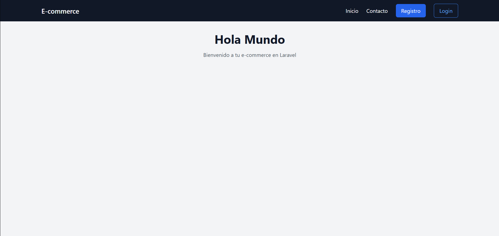
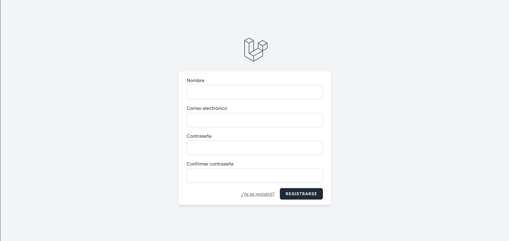
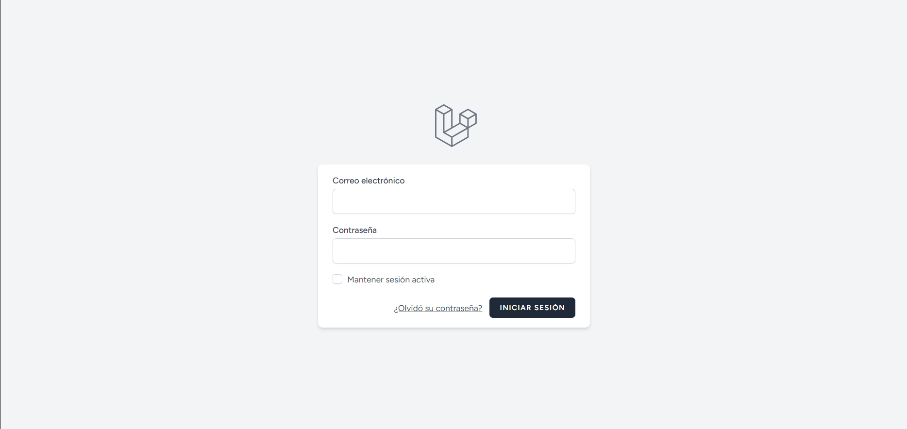
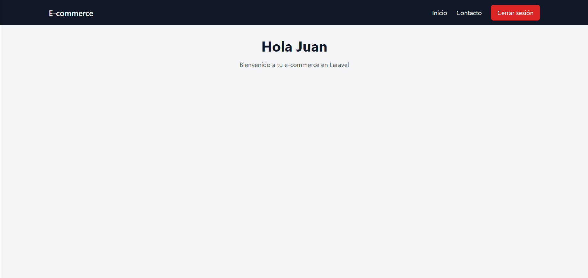
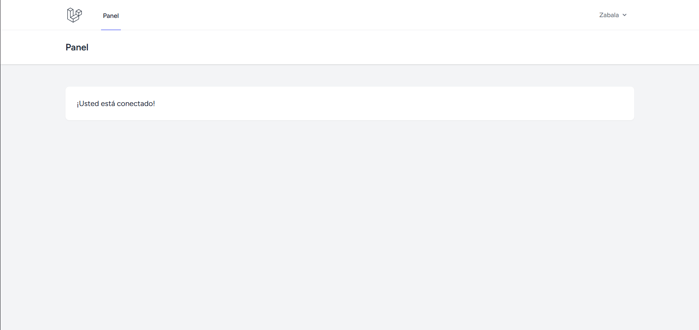
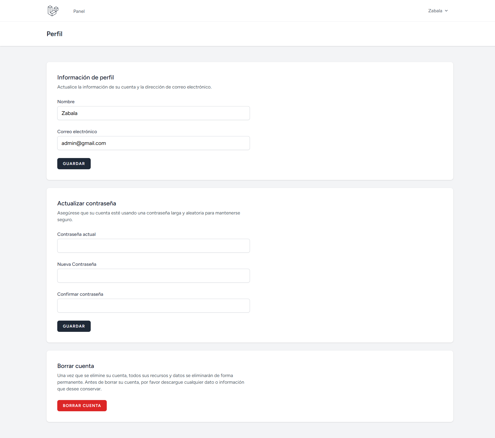

# 🌐 Laravel E-commerce App

Aplicación e-commerce desarrollada con **Laravel**, con fines de aprendizaje.

---

# ✨ Tecnologías
- **Framework:** Laravel
- **DB:** SQLite
- **Registro / Login:** Breeze
- **CSS:** Tailwind
- **JS:** Alpine

---

## 📸 Capturas de pantalla

### Inicio (Público)


### Registro


### Login


### Inicio (Cliente)


### Dashboard (Admin)


### Perfil (Admin)


---

# 🛠️ Requisitos

Tener instalado:
- PHP >= 8.1
- Composer
- Node.js
- npm

En el archivo `php.ini`, asegúrate de tener habilitadas las siguientes extensiones:
- curl
- mbstring
- openssl
- fileinfo
- pdo_sqlite
- zip

## ⚙️ Variables de entorno

Copiar el archivo `.env.example`:
```bash
cp .env.example .env
```

Generar la clave de la aplicación (`APP_KEY`):
```bash
php artisan key:generate
```

## 🗄️ Base de datos

Para este proyecto se utiliza **SQLite** (ideal para aprendizaje).

Para ejecutar las migraciones que ya vienen por defecto, crea el archivo `database.sqlite` dentro de la carpeta `database/` y luego ejecuta:

```bash
php artisan migrate
```

### 👥 Roles de usuario

La aplicación maneja roles de usuario para controlar el acceso a ciertas funcionalidades:

- `client`: Usuario normal
- `admin`: Usuario administrador (acceso al dashboard)

Por defecto, todos los usuarios registrados tienen el rol `client`.

### 🔑 Asignar rol administrador (dev)

Para cambiar rápidamente el rol de un usuario durante el desarrollo, puedes usar Tinker.

1. Abrir tinker:
```bash
php artisan tinker
```

2. Cambiar el rol a un usuario registrado:
```php
$user = App\Models\User::where('email', 'admin@email.com')->first();
$user->role = 'admin';
$user->save();
```
Esto otorgará permisos de administrador al usuario indicado.

⚠️ *Este método está pensado solo para entornos de desarrollo*.

---

## ⚡ Ejecutar Vite (dev)

En la `raíz` del proyecto, ejecuta:
```bash
npm install # instalar dependencias
npm run dev # ejecutar (modo dev)
```
⚠️ *Mantén este proceso corriendo mientras desarrollas*.

---

## 🚀 Ejecutar aplicación Laravel
En la `raíz` del proyecto ejecutar:
```bash
php artisan serve
```