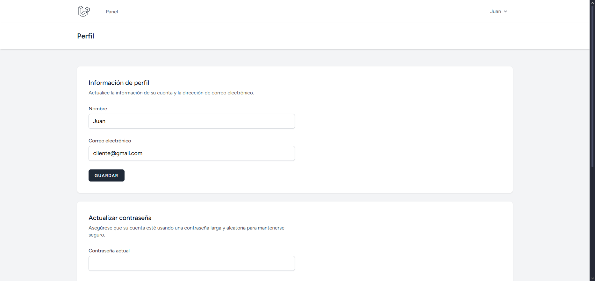

# 🌐 Laravel E-commerce App

Aplicación e-commerce desarrollada con **Laravel**, con fines de aprendizaje.

---

# ✨ Tecnologías
- **Framework:** Laravel
- **DB:** SQLite
- **Registro / Login:** Breeze
- **CSS:** Tailwind
- **JS:** Alpine

---

## 📸 Capturas de pantalla

### Página principal


### Registro


### Login


### Dashboard


### Perfil


---

# 🛠️ Requisitos

Tener instalado:
- PHP >= 8.1
- Composer
- Node.js
- npm

En el archivo `php.ini`, asegúrate de tener habilitadas las siguientes extensiones:
- curl
- mbstring
- openssl
- fileinfo
- pdo_sqlite
- zip

## ⚙️ Variables de entorno

Copiar el archivo `.env.example`:
```bash
cp .env.example .env
```

Generar la clave de la aplicación (`APP_KEY`):
```bash
php artisan key:generate
```

## 🗄️ Base de datos

Para este proyecto se utiliza **SQLite** (ideal para aprendizaje).

Crea el archivo `database.sqlite` dentro de la carpeta `database/`, y luego ejecuta las migraciones que ya vienen por defecto:

```bash
php artisan migrate
```

---

## ⚡ Ejecutar Vite

En la `raíz` del proyecto, ejecuta:
```bash
npm install # instalar dependencias
npm run dev # ejecutar (modo dev)
```
⚠️ Mantén este proceso corriendo mientras desarrollas.

---

## 🚀 Ejecutar aplicación Laravel
En la `raíz` del proyecto ejecutar:
```bash
php artisan serve
```